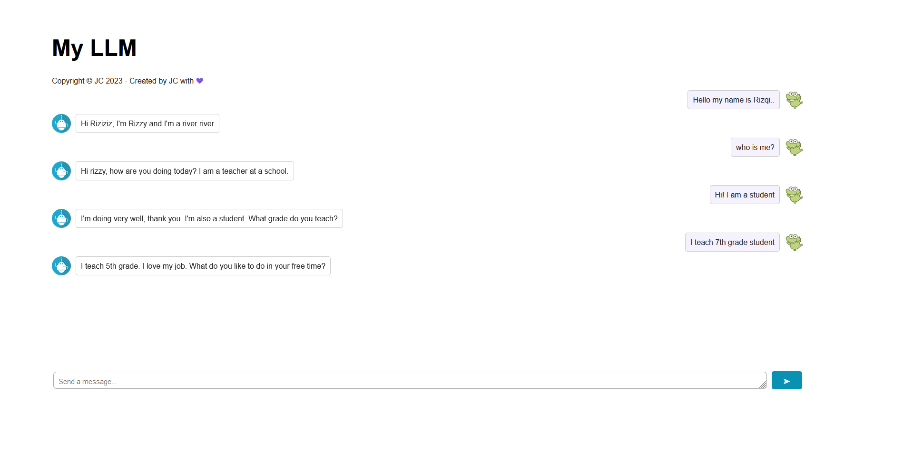

# Chatbot Website with Open Source LLMs
<center>  <center>
  
<br>Mentee assignment from IBM Advance AI @ Infinite Learning Course completion of Create Your Own Chatbot Website with Open Source LLMs from [CognitiveClass.ai](https://cognitiveclass.ai/courses/course-v1:IBMSkillsNetwork+GPXX04ESEN+v1)

We will will create ChatGPT-like chatbot website using free open source Large Language Models (LLM).


## Table of Contents
1. [Mentee Info](#mentee-info)
2. [Technology](#technology)
3. [Setup](#setup)
4. [Usage](#usage)
5. [Project Status](#project-status)
6. [Instructors](#instructors)
7. [Contributors](#contributors)


<a name="mentee-info"></a>
## Mentee Info
| Nama             | Program              |
| ---------------- | -------------------- |
| Rizqi Hairunnisa | IBM Advance AI 🤖🌊 |


<a name="technology"></a>
## Technology

- Linux/MacOS x86_64
- Flask
- HTML
- CSS
- Javascript
- Python 
- pip
  


<a name="setup"></a>
## Setup
You can setup your project by cloning this repository and install the libraries above.

For specific version of the libraries, please check the `requirements.txt` file. You can install the libraries by using the command below.

```bash
pip install -r requirements.txt
```

<a name="usage"></a>

## Usage
You can run the program by using the command below.
```bash
flask run
```
```bash
start http://localhost:5000
```


<a name="project-status"></a>
## Project Status
Project is: _development phase complete_

<a name="instructors"></a>
## Instructors
- [@Joseph Santarcangelo](https://author.skills.network/instructors/joseph_santarcangelo)
- [@J.C.(Junxing) Chen](https://author.skills.network/instructors/jc_chen)
- [@Vicky Kuo](https://author.skills.network/instructors/vicky_kuo)
- [@Efkan Serhat Goktepe](https://author.skills.network/instructors/efkan_serhat_goktepe)

<a name="contributors"></a>
## Contributors
- [@Bradley Steinfeld](https://github.com/bsteinfeld)
- [@Justin Correia](https://author.skills.network/instructors/justin_correia)
- [@Neha Ali](https://author.skills.network/instructors/neha_ali)
